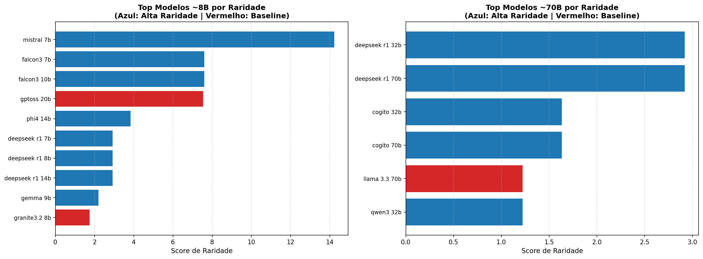

# Escolha de Modelos SLMs

## Objetivo

Calcular um **score de raridade arquitetural** para cada modelo, priorizando modelos com **combinações únicas** de características técnicas. Isso garante:

1. **Diversidade máxima** no conjunto de modelos testados
2. **Cobertura representativa** das arquiteturas existentes
3. **Evitar redundância** entre modelos similares
4. **Identificar arquiteturas pouco representativas** que merecem atenção especial

## Características Avaliadas

A métrica considera **4 dimensões arquiteturais**:

| Característica | Tipo | Exemplos | Impacto |
|----------------|------|----------|---------|
| **Attention** | Categórico | MHA, GQA, MLA, MoE | Mecanismo de atenção do modelo |
| **Activation** | Categórico | SwiGLU, GeGLU, ReLU | Função de ativação das camadas |
| **Layer Norm** | Categórico | RMSNorm, LayerNorm | Método de normalização |
| **Context Window** | Numérico | 8K, 128K, 262K tokens | Capacidade de contexto |

---

## Fórmula do Score de Raridade

### 1. Cálculo de Pesos Individuais

Para cada característica categórica, o peso de raridade é dado por:

$$\text{Peso}(\text{valor}) = \frac{N}{\text{contagem}(\text{valor})}$$

Onde:

- $N$ = número total de modelos no dataset

- $\text{contagem}(\text{valor})$ = quantas vezes aquele valor aparece

**Interpretação**: Valores raros recebem pesos altos, valores comuns recebem pesos baixos.

### 2. Normalização do Context Window

Como o Context Window é numérico e possui valores muito maiores que os pesos categóricos, aplicamos normalização:

$$\text{Peso}_{\text{Context}}^{\text{norm}} = \frac{\text{Peso}_{\text{Context}}}{\max(\text{Peso}_{\text{Context}})} \times \overline{\text{Peso}_{\text{Attention}}}$$

Isso mantém todas as características na mesma escala de grandeza.

### 3. Score Final

O score total do modelo é a **média aritmética dos 4 pesos**:

$$\text{Score}_{\text{Raridade}} = \frac{\text{Peso}_{\text{Attention}} + \text{Peso}_{\text{Activation}} + \text{Peso}_{\text{LayerNorm}} + \text{Peso}_{\text{Context}}^{\text{norm}}}{4}$$

**Quanto maior o score, mais rara/única é a arquitetura do modelo.**

## Filtro de Versões

Antes do cálculo de raridade, aplicamos um **filtro de versões mais recentes**:

### Regra
Para cada combinação de **(Família, Tamanho)**, mantemos apenas a **versão mais recente**.

### Exemplos

- **Phi-3 14B** vs **Phi-4 14B** → Mantém apenas **Phi-4 14B**

- **Qwen2.5 8B** vs **Qwen3 8B** → Mantém apenas **Qwen3 8B**

- **Llama 3.1 70B** vs **Llama 3.3 70B** → Mantém apenas **Llama 3.3 70B** 

### Justificativa

- Evita testar múltiplas versões do mesmo modelo base

- Prioriza arquiteturas mais modernas e otimizadas

- Reduz redundância mantendo diversidade arquitetural

## Interpretação dos Scores

### Alta Raridade (Score > 10)
Arquiteturas diferenciadas com combinações pouco comuns:
- **DeepSeek R1**: MLA (Multi-head Latent Attention) - único com essa arquitetura
- **Falcon3**: ReLU + LayerNorm - combinação rara em modelos modernos
- **GPT-OSS**: MoE (Mixture of Experts) - poucos modelos usam

### Raridade Moderada (Score 5-10)
Combinações menos comuns, mas não únicas:
- **Phi-4**: MHA + GeGLU - menos comum que GQA
- **Gemma**: GQA + GeGLU - GeGLU é menos comum que SwiGLU

### Baixa Raridade (Score < 5)
Arquitetura padrão predominante:
- **GQA + SwiGLU + RMSNorm + 128K tokens** configuração mais comum
- Presente em Llama, Mistral, Qwen, etc.

## Estratégia de Seleção

### Categorias de Tamanho
- **Categoria ~8B**: Modelos entre 7B e 20B parâmetros
- **Categoria ~70B**: Modelos entre 32B e 70B parâmetros

### Processo de Seleção
1. Filtrar modelos por faixa de tamanho
2. Ordenar por score de raridade (decrescente)
3. Selecionar **Top N modelos** mais raros
4. **Garantir inclusão de baselines** importantes (mesmo com raridade baixa)

### Baselines Obrigatórios
Modelos de referência que sempre entram na seleção:
- **Llama 3.1 8B** e **Llama 3.3 70B** - Referências open-source
- **Foundation-Sec 8B** - Modelo especializado em segurança
- **GPT-OSS 20B** - Arquitetura MoE rara
- **Granite3.2 8B** - Modelo recente da IBM

---

## Vantagens da Métrica

- **Objetiva e Quantificável**: Baseada em frequências reais dos dados  
- **Escalável**: Funciona para qualquer tamanho de dataset  
- **Adaptativa**: Atualiza automaticamente com novos modelos  
- **Transparente**: Fórmula clara e auditável  
- **Balanceada**: Combina múltiplas dimensões arquiteturais  
- **Prática**: Garante diversidade sem perder modelos-referência  

---git pull origin exp24

## Exemplo Prático

Considere um dataset com:
- 40 modelos GQA, 10 modelos MHA, 5 modelos MLA
- 45 modelos SwiGLU, 8 modelos GeGLU, 2 modelos ReLU

### Cálculo para DeepSeek R1 8B (MLA + SwiGLU + RMSNorm + 128K)

$$\text{Peso}_{\text{Attention}} = \frac{55}{5} = 11.0 \quad \text{(MLA é raro)}$$

$$\text{Peso}_{\text{Activation}} = \frac{55}{45} = 1.22 \quad \text{(SwiGLU é comum)}$$

$$\text{Peso}_{\text{LayerNorm}} = \frac{55}{50} = 1.10 \quad \text{(RMSNorm é comum)}$$

$$\text{Peso}_{\text{Context}}^{\text{norm}} = 1.5 \quad \text{(após normalização)}$$

$$\text{Score}_{\text{Raridade}} = \frac{11.0 + 1.22 + 1.10 + 1.5}{4} = \mathbf{3.71}$$

O **MLA contribui fortemente** para um score elevado, tornando DeepSeek um modelo prioritário para testes.

##  Conclusão

Esta métrica permite selecionar um conjunto **diverso e representativo** de LLMs, garantindo:
- Cobertura de diferentes paradigmas arquiteturais
- Identificação de inovações técnicas importantes
- Eficiência nos testes (evita redundância)

