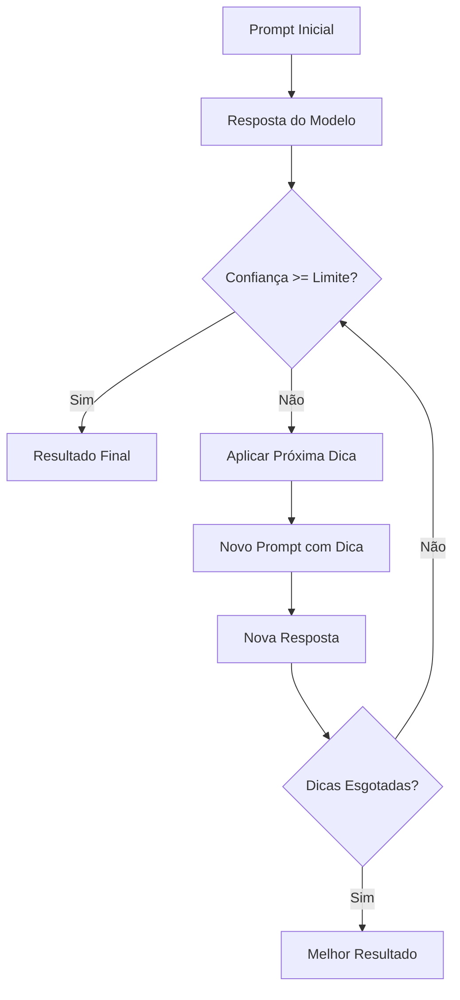

# Técnicas de Prompt

## Introdução

Este documento detalha as técnicas de prompt implementadas no framework, explicando como cada uma funciona, quando usar e como configurar para obter os melhores resultados na classificação de incidentes de segurança.

## Visão Geral das Técnicas

### Resumo Comparativo

| Técnica | Complexidade | Precisão | Velocidade | Custo | Melhor Para |
|---------|--------------|-----------|------------|-------|-------------|
| **Progressive Hint** | Alta | ⭐⭐⭐⭐⭐ | ⭐⭐⭐ | ⭐⭐ | Casos complexos, alta precisão |
| **Self Hint** | Média | ⭐⭐⭐⭐ | ⭐⭐⭐⭐ | ⭐⭐⭐ | Autoavaliação, melhoria iterativa |
| **Progressive Rectification** | Média | ⭐⭐⭐⭐ | ⭐⭐⭐ | ⭐⭐ | Correção de erros, refinamento |
| **Hypothesis Testing** | Alta | ⭐⭐⭐⭐⭐ | ⭐⭐ | ⭐ | Análise científica, validação |

## Progressive Hint Prompting

### Conceito

Progressive Hint Prompting é uma técnica que fornece dicas incrementais ao modelo quando a resposta inicial não atinge o nível de confiança desejado. As dicas são estruturadas de forma a guiar o modelo progressivamente para uma resposta mais precisa.

### Como Funciona



### Implementação

```python
class ProgressiveHintPlugin(BasePromptTechnique):
    """Plugin Progressive Hint Prompting."""
    
    def __init__(self, config: Dict[str, Any]):
        super().__init__(config)
        self.max_hints = config.get('max_hints', 4)
        self.limite_rouge = config.get('limite_rouge', 0.9)
        self.hints = self._load_hints()
    
    def execute(self, text: str, model: BaseModel) -> Dict[str, Any]:
        """Executa Progressive Hint Prompting."""
        
        # Prompt inicial
        initial_prompt = self._build_initial_prompt(text)
        best_result = self._query_model(model, initial_prompt)
        
        # Aplicar dicas progressivamente
        for hint_level in range(1, self.max_hints + 1):
            if self._is_confident_enough(best_result):
                break
                
            # Construir prompt com dica
            hint_prompt = self._build_hint_prompt(text, hint_level, best_result)
            new_result = self._query_model(model, hint_prompt)
            
            # Verificar se houve melhoria
            if self._is_better_result(new_result, best_result):
                best_result = new_result
                
                # Verificar ROUGE limit para parada antecipada
                if self._check_rouge_limit(new_result, best_result):
                    break
        
        return self._format_result(best_result, hint_level)
    
    def _build_initial_prompt(self, text: str) -> str:
        """Constrói prompt inicial."""
        template = """
        Você é um especialista em classificação de incidentes de segurança usando as categorias NIST.
        
        Analise o seguinte incidente e classifique-o:
        
        INCIDENTE: {text}
        
        CATEGORIAS NIST DISPONÍVEIS:
        - CAT1: Account Compromise (Comprometimento de Conta)
        - CAT2: Malware (Software Malicioso)
        - CAT3: Denial of Service (Negação de Serviço)
        - CAT4: Data Leak (Vazamento de Dados)
        - CAT5: Vulnerability Exploitation (Exploração de Vulnerabilidade)
        - CAT6: Network Intrusion (Intrusão de Rede)
        - CAT7: Social Engineering (Engenharia Social)
        - CAT8: Physical Security (Segurança Física)
        - CAT9: Configuration Error (Erro de Configuração)
        - CAT10: Other (Outro)
        
        Responda no formato:
        CATEGORIA: [código da categoria]
        EXPLICAÇÃO: [justificativa detalhada]
        CONFIANÇA: [valor entre 0 e 1]
        """
        return template.format(text=text)
    
    def _build_hint_prompt(self, text: str, hint_level: int, previous_result: dict) -> str:
        """Constrói prompt com dica específica."""
        
        hints = {
            1: """
            DICA 1: Considere as seguintes características específicas:
            - Palavras-chave relacionadas a cada categoria
            - Contexto do ambiente (rede, sistema, aplicação)
            - Impacto potencial do incidente
            - Método de detecção mencionado
            """,
            
            2: """
            DICA 2: Analise mais profundamente:
            - Atores envolvidos (internos/externos, automatizados/humanos)
            - Recursos afetados (dados, sistemas, rede, pessoas)
            - Temporalidade (em andamento, concluído, detectado após tempo)
            - Indicadores técnicos específicos
            """,
            
            3: """
            DICA 3: Considere cenários complexos:
            - Incidentes podem ter múltiplas facetas
            - Classificação primária vs. secundária
            - Cadeia de eventos (causa raiz vs. sintoma)
            - Correlação com outros incidentes
            """,
            
            4: """
            DICA 4: Revisão final crítica:
            - Sua classificação anterior foi: {previous_category}
            - Confiança anterior: {previous_confidence}
            - Reconsidere se há evidências que suportem outra categoria
            - Justifique por que esta classificação é mais apropriada
            """
        }
        
        hint_text = hints.get(hint_level, "")
        if hint_level == 4 and previous_result:
            hint_text = hint_text.format(
                previous_category=previous_result.get('categoria', 'N/A'),
                previous_confidence=previous_result.get('confianca', 0)
            )
        
        template = """
        Você é um especialista em classificação de incidentes de segurança.
        
        INCIDENTE: {text}
        
        {hint}
        
        Com base na dica acima, reclassifique o incidente:
        
        CATEGORIA: [código da categoria]
        EXPLICAÇÃO: [justificativa detalhada considerando a dica]
        CONFIANÇA: [valor entre 0 e 1]
        """
        
        return template.format(text=text, hint=hint_text)
```

### Configuração Avançada

```json
{
  "progressive_hint": {
    "plugin": "ProgressiveHintPlugin",
    "max_hints": 4,
    "limite_rouge": 0.9,
    "hint_strategy": "adaptive",
    "confidence_improvement_threshold": 0.1,
    "early_stopping": {
      "enabled": true,
      "confidence_threshold": 0.95,
      "rouge_threshold": 0.85
    },
    "hint_templates": {
      "custom": true,
      "template_dir": "templates/progressive_hint/",
      "fallback_to_default": true
    }
  }
}
```

## Self Hint Prompting

### Conceito

Self Hint permite que o modelo generate suas próprias dicas através de auto-reflexão, melhorando iterativamente sua resposta inicial.

### Implementação

```python
class SelfHintPlugin(BasePromptTechnique):
    """Plugin Self Hint Prompting."""
    
    def execute(self, text: str, model: BaseModel) -> Dict[str, Any]:
        """Executa Self Hint Prompting."""
        
        # 1. Classificação inicial
        initial_result = self._initial_classification(text, model)
        
        # 2. Auto-reflexão
        reflection = self._self_reflection(text, initial_result, model)
        
        # 3. Melhoria baseada na reflexão
        improved_result = self._improve_classification(
            text, initial_result, reflection, model
        )
        
        return improved_result
    
    def _initial_classification(self, text: str, model: BaseModel) -> dict:
        """Classificação inicial."""
        prompt = f"""
        Classifique este incidente de segurança:
        
        INCIDENTE: {text}
        
        Forneça:
        - CATEGORIA: código NIST
        - EXPLICAÇÃO: sua justificativa
        - CONFIANÇA: nível de certeza (0-1)
        """
        return self._query_model(model, prompt)
    
    def _self_reflection(self, text: str, result: dict, model: BaseModel) -> str:
        """Auto-reflexão sobre a classificação."""
        prompt = f"""
        Você classificou este incidente como {result.get('categoria')} 
        com confiança {result.get('confianca')}.
        
        INCIDENTE: {text}
        SUA CLASSIFICAÇÃO: {result.get('categoria')}
        SUA EXPLICAÇÃO: {result.get('explicacao')}
        
        Agora reflita criticamente:
        1. Que evidências SUPORTAM esta classificação?
        2. Que evidências CONTRADIZEM esta classificação?
        3. Que aspectos você pode ter perdido?
        4. Há ambiguidades no texto que precisam ser consideradas?
        5. Outras categorias poderiam se aplicar?
        
        Seja honesto sobre incertezas e limitações.
        """
        return self._query_model(model, prompt)
    
    def _improve_classification(
        self, 
        text: str, 
        initial: dict, 
        reflection: str, 
        model: BaseModel
    ) -> dict:
        """Melhora classificação baseada na reflexão."""
        prompt = f"""
        Com base na sua reflexão, reclassifique o incidente:
        
        INCIDENTE: {text}
        CLASSIFICAÇÃO INICIAL: {initial.get('categoria')}
        SUA REFLEXÃO: {reflection}
        
        Considerando sua análise crítica, forneça a classificação FINAL:
        
        CATEGORIA: [código final]
        EXPLICAÇÃO: [justificativa considerando a reflexão]
        CONFIANÇA: [confiança atualizada 0-1]
        MUDANÇAS: [o que mudou e por quê]
        """
        return self._query_model(model, prompt)
```

## Progressive Rectification

### Conceito

Progressive Rectification compara respostas sucessivas e corrige inconsistências ou erros identificados entre iterações.

### Fluxo de Funcionamento

```python
class ProgressiveRectificationPlugin(BasePromptTechnique):
    """Plugin Progressive Rectification."""
    
    def execute(self, text: str, model: BaseModel) -> Dict[str, Any]:
        """Executa Progressive Rectification."""
        
        results = []
        
        # Gerar múltiplas classificações iniciais
        for i in range(self.config.get('num_initial_attempts', 3)):
            result = self._classify_with_variation(text, model, i)
            results.append(result)
        
        # Identificar inconsistências
        inconsistencies = self._identify_inconsistencies(results)
        
        # Rectificar progressivamente
        best_result = results[0]
        for rectification_round in range(self.config.get('max_rectifications', 3)):
            if not inconsistencies:
                break
                
            rectified = self._rectify_classification(
                text, results, inconsistencies, model
            )
            
            if self._is_improvement(rectified, best_result):
                best_result = rectified
                results.append(rectified)
                inconsistencies = self._identify_inconsistencies(results[-2:])
        
        return best_result
    
    def _classify_with_variation(self, text: str, model: BaseModel, variation: int) -> dict:
        """Classifica com pequenas variações no prompt."""
        
        variations = [
            "Analise este incidente de segurança e classifique:",
            "Como especialista, classifique este incidente:",
            "Determine a categoria NIST deste incidente:"
        ]
        
        prompt_start = variations[variation % len(variations)]
        
        prompt = f"""
        {prompt_start}
        
        INCIDENTE: {text}
        
        Responda com:
        CATEGORIA: [código NIST]
        EXPLICAÇÃO: [justificativa]
        CONFIANÇA: [0-1]
        """
        
        return self._query_model(model, prompt)
    
    def _identify_inconsistencies(self, results: List[dict]) -> List[str]:
        """Identifica inconsistências entre resultados."""
        inconsistencies = []
        
        if len(results) < 2:
            return inconsistencies
        
        # Verificar categorias diferentes
        categories = [r.get('categoria') for r in results]
        if len(set(categories)) > 1:
            inconsistencies.append(
                f"Categorias inconsistentes: {set(categories)}"
            )
        
        # Verificar grandes diferenças de confiança
        confidences = [r.get('confianca', 0) for r in results]
        if max(confidences) - min(confidences) > 0.3:
            inconsistencies.append(
                f"Grande variação de confiança: {min(confidences):.2f} - {max(confidences):.2f}"
            )
        
        return inconsistencies
    
    def _rectify_classification(
        self, 
        text: str, 
        results: List[dict], 
        inconsistencies: List[str], 
        model: BaseModel
    ) -> dict:
        """Rectifica classificação baseada em inconsistências."""
        
        results_summary = "\n".join([
            f"Tentativa {i+1}: {r.get('categoria')} (confiança: {r.get('confianca', 0):.2f})"
            for i, r in enumerate(results[-3:])  # Últimas 3 tentativas
        ])
        
        prompt = f"""
        Você fez várias tentativas de classificação deste incidente e houve inconsistências:
        
        INCIDENTE: {text}
        
        SUAS TENTATIVAS ANTERIORES:
        {results_summary}
        
        INCONSISTÊNCIAS IDENTIFICADAS:
        {chr(10).join(inconsistencies)}
        
        Agora, considerando todas as tentativas anteriores e as inconsistências:
        
        1. Analise por que houve essas diferenças
        2. Identifique qual classificação é mais fundamentada
        3. Forneça uma classificação CORRIGIDA e DEFINITIVA
        
        CATEGORIA: [categoria corrigida]
        EXPLICAÇÃO: [por que esta é a classificação correta]
        CONFIANÇA: [confiança na correção]
        CORREÇÕES: [o que foi corrigido e por quê]
        """
        
        return self._query_model(model, prompt)
```

## Hypothesis Testing

### Conceito

Hypothesis Testing formula múltiplas hipóteses sobre a classificação e testa cada uma com evidências, selecionando a mais suportada.

### Implementação

```python
class HypothesisTestingPlugin(BasePromptTechnique):
    """Plugin Hypothesis Testing."""
    
    def execute(self, text: str, model: BaseModel) -> Dict[str, Any]:
        """Executa Hypothesis Testing."""
        
        # 1. Gerar hipóteses
        hypotheses = self._generate_hypotheses(text, model)
        
        # 2. Coletar evidências para cada hipótese
        evidence_results = []
        for hypothesis in hypotheses:
            evidence = self._collect_evidence(text, hypothesis, model)
            evidence_results.append({
                'hypothesis': hypothesis,
                'evidence': evidence,
                'score': self._score_evidence(evidence)
            })
        
        # 3. Selecionar melhor hipótese
        best_hypothesis = max(evidence_results, key=lambda x: x['score'])
        
        # 4. Conclusão final
        final_result = self._draw_conclusion(text, evidence_results, model)
        
        return final_result
    
    def _generate_hypotheses(self, text: str, model: BaseModel) -> List[str]:
        """Gera hipóteses de classificação."""
        prompt = f"""
        Como especialista em segurança, formule 3 hipóteses plausíveis 
        sobre a classificação deste incidente:
        
        INCIDENTE: {text}
        
        Para cada hipótese, forneça:
        HIPÓTESE 1: [categoria] - [breve justificativa]
        HIPÓTESE 2: [categoria] - [breve justificativa] 
        HIPÓTESE 3: [categoria] - [breve justificativa]
        
        Escolha as 3 categorias mais prováveis baseado em evidências iniciais.
        """
        
        response = self._query_model(model, prompt)
        return self._parse_hypotheses(response)
    
    def _collect_evidence(self, text: str, hypothesis: str, model: BaseModel) -> dict:
        """Coleta evidências para uma hipótese específica."""
        prompt = f"""
        Teste esta hipótese específica:
        
        INCIDENTE: {text}
        HIPÓTESE: {hypothesis}
        
        Colete evidências que SUPORTAM e que CONTRADIZEM esta hipótese:
        
        EVIDÊNCIAS A FAVOR:
        - [lista evidências que suportam]
        
        EVIDÊNCIAS CONTRA:
        - [lista evidências que contradizem]
        
        FORÇA DAS EVIDÊNCIAS: [forte/moderada/fraca]
        PROBABILIDADE: [0-1]
        """
        
        return self._query_model(model, prompt)
    
    def _draw_conclusion(self, text: str, evidence_results: List[dict], model: BaseModel) -> dict:
        """Tira conclusão final baseada em todas as evidências."""
        
        evidence_summary = "\n\n".join([
            f"HIPÓTESE: {er['hypothesis']}\n"
            f"EVIDÊNCIAS: {er['evidence']}\n"
            f"SCORE: {er['score']:.2f}"
            for er in evidence_results
        ])
        
        prompt = f"""
        Baseado na análise sistemática de hipóteses, forneça a conclusão final:
        
        INCIDENTE: {text}
        
        ANÁLISE DE HIPÓTESES:
        {evidence_summary}
        
        Com base na avaliação científica das evidências:
        
        CATEGORIA: [categoria com maior suporte evidencial]
        EXPLICAÇÃO: [síntese das evidências que suportam esta conclusão]
        CONFIANÇA: [baseada na força das evidências, 0-1]
        MÉTODO: [resumo do processo de teste de hipóteses usado]
        """
        
        return self._query_model(model, prompt)
```

## Configuração por Cenário

### Para Alta Precisão (Ambiente Crítico)

```json
{
  "prompt_techniques": {
    "high_precision": {
      "plugin": "HypothesisTestingPlugin",
      "num_hypotheses": 5,
      "evidence_depth": "deep",
      "confidence_threshold": 0.9,
      "fallback_technique": "progressive_hint"
    }
  }
}
```

### Para Performance (Volume Alto)

```json
{
  "prompt_techniques": {
    "high_performance": {
      "plugin": "SelfHintPlugin",
      "max_iterations": 2,
      "confidence_threshold": 0.7,
      "timeout": 15
    }
  }
}
```

### Para Casos Complexos (Análise Forense)

```json
{
  "prompt_techniques": {
    "complex_analysis": {
      "plugin": "ProgressiveHintPlugin",
      "max_hints": 6,
      "limite_rouge": 0.95,
      "deep_analysis": true,
      "multi_category": true
    }
  }
}
```

## Métricas e Avaliação

### Métricas de Qualidade

- **Precisão**: Percentual de classificações corretas
- **Confiança Média**: Nível médio de confiança das classificações
- **Consistência**: Variação entre múltiplas execuções
- **Tempo de Processamento**: Eficiência da técnica
- **Custo de Tokens**: Uso de recursos de API

### Avaliação Comparativa

O framework inclui ferramentas para comparar técnicas:

```bash
python scripts/evaluate_techniques.py \
  --data data/test_incidents.csv \
  --techniques progressive_hint,self_hint,hypothesis_testing \
  --models openai_gpt4,ollama_deepseek \
  --output evaluation_report.html
```

### Recomendações de Uso

1. **Progressive Hint**: Use para casos onde precisão é crítica
2. **Self Hint**: Ideal para processamento em lote com boa eficiência
3. **Progressive Rectification**: Útil quando há incerteza na classificação
4. **Hypothesis Testing**: Melhor para análise forense e casos complexos

Cada técnica pode ser combinada com diferentes modelos para otimizar resultados específicos do seu ambiente.