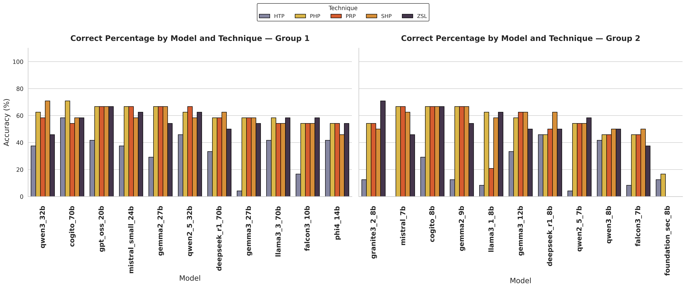
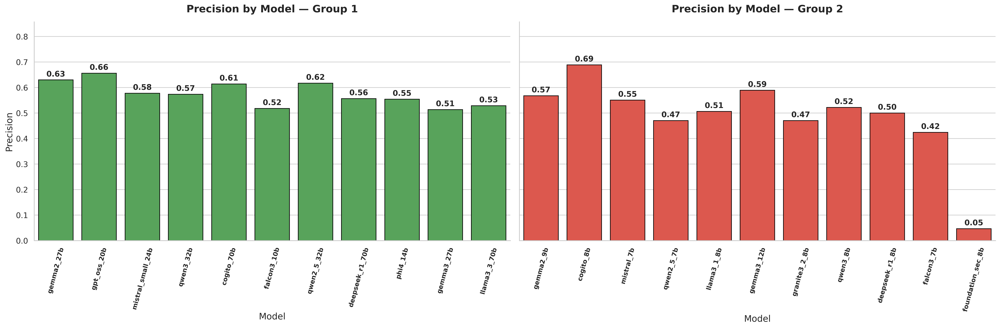
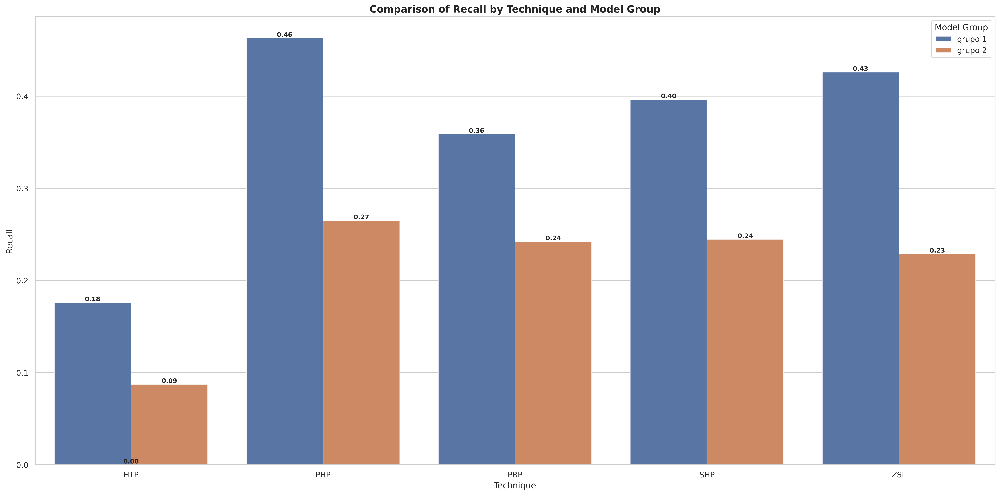
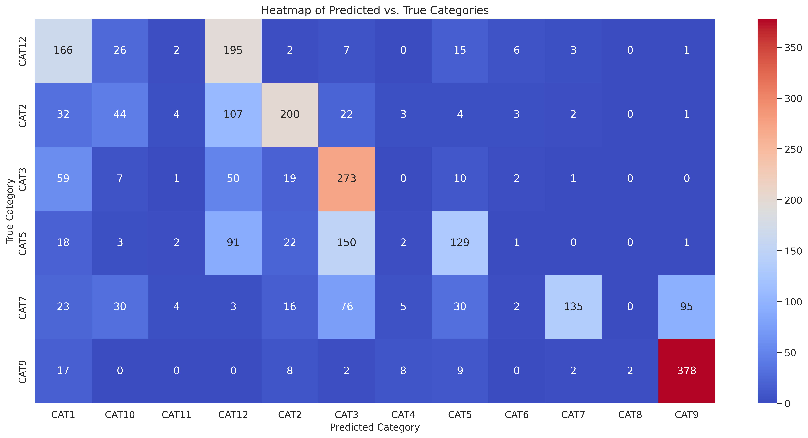
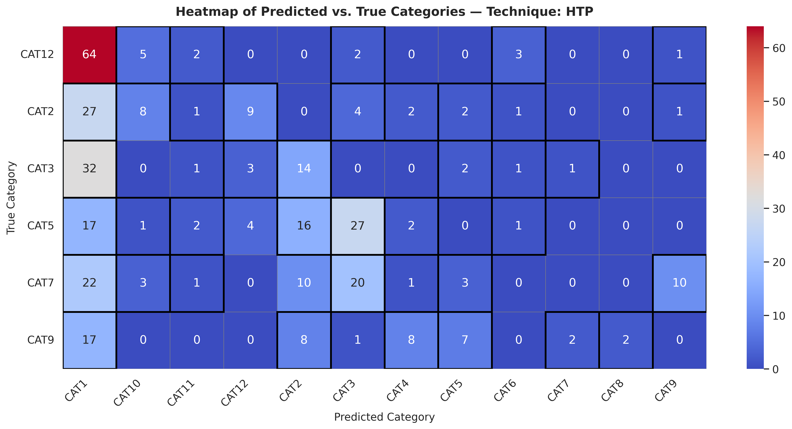
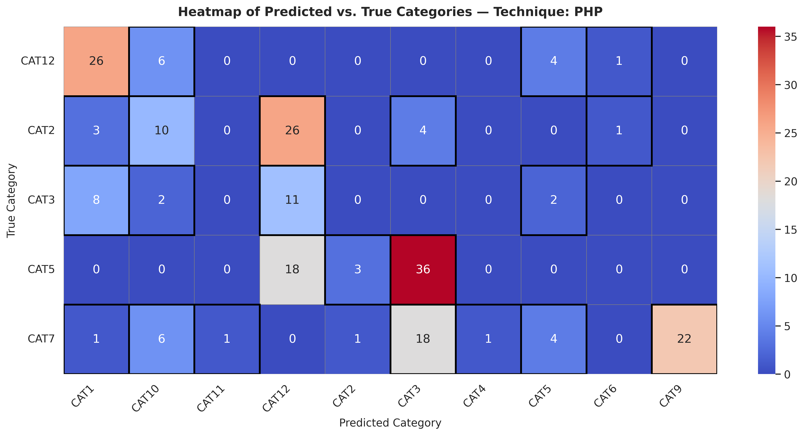
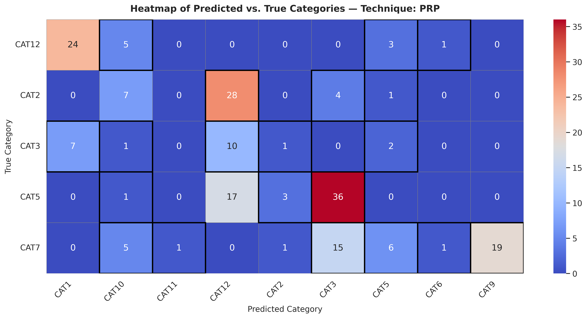
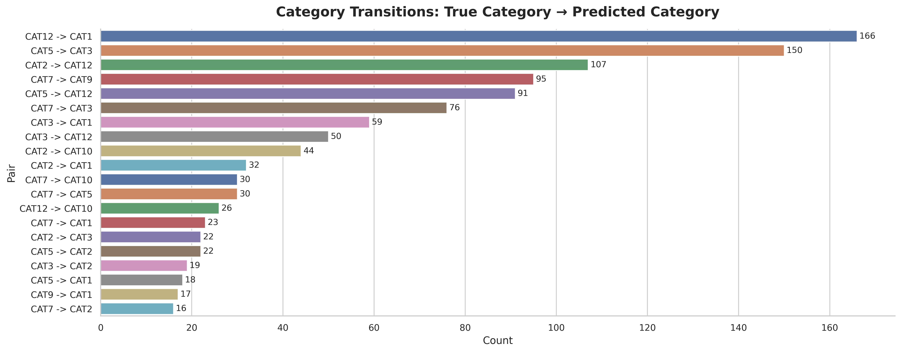

# On-Premise SLMs vs. Commercial LLMs: Prompt Engineering and Incident Classification in SOCs and CSIRTs

This study evaluates the use of open-source models in classifying information security incidents, comparing their performance with previously analyzed proprietary models. For this purpose, it uses a balanced set of real and anonymized incidents from Brazilian CSIRTs and SOCs, classified according to the NIST SP 800-61r3 taxonomy and subjected to five prompt engineering techniques: Progressive Hint Prompting (PHP), Self Hint Prompting (SHP), Hypothesis Testing Prompting (HTP), Progressive Rectification Prompting (PRP), and Zero-Shot Learning (ZSL). The objective is to verify whether open models, executed locally, can maintain accuracy and consistency levels close to those of commercial LLMs, justifying investments in internal infrastructure. The results show that, although proprietary models still present superior performance, open-source alternatives offer relevant benefits in terms of privacy, cost, and data sovereignty, establishing themselves as a viable option for corporate and institutional environments that demand compliance and confidentiality.

## **Table 1 — Security Incident Categorization (with priority)**

| Code  | Category                          | Description                                                              | Priority |
|-------|-----------------------------------|--------------------------------------------------------------------------|----------|
| CAT1  | Account Compromise                | Unauthorized access to user or administrator accounts.                   | 5 |
| CAT2  | Malware                           | Infection by malicious code that compromises devices or data.            | 5 |
| CAT3  | Denial of Service Attack          | Making systems or networks unavailable.                                  | 4 |
| CAT4  | Data Exfiltration or Leak         | Unauthorized access, copying, or disclosure of sensitive data.           | 5 |
| CAT5  | Vulnerability Exploitation        | Use of flaws to compromise assets.                                       | 5 |
| CAT6  | Insider Abuse                     | Malicious or negligent actions by internal users.                        | 5 |
| CAT7  | Social Engineering                | Deception to obtain access or information.                               | 3 |
| CAT8  | Physical/Infrastructure Incident  | Physical violation that impacts computational assets.                    | 4 |
| CAT9  | Unauthorized Alteration           | Unauthorized modification to systems, data, or configurations.           | 3 |
| CAT10 | Misuse of Resources               | Unauthorized use of systems for other purposes.                          | 2 |
| CAT11 | Supplier/Third-Party Issue        | Security failure originating from third parties.                         | 4 |
| CAT12 | Intrusion Attempt                 | Unconfirmed hostile invasion attempts.                                   | 3 |

**Source: NIST (National Institute of Standards and Technology)**

## **Selected Model Tables**

### **Group 1 Models**

| Model             | Size | Window (tokens) | Attention | Activation | Normalization |
|-------------------|------|------------------|-----------|------------|---------------|
| Cogito 70B        | 70B  | 128,000          | MHA       | SwiGLU     | RMSNorm |
| DeepSeek R1 70B   | 70B  | 128,000          | MLA       | SwiGLU     | RMSNorm |
| Falcon3 10B       | 10B  | 32,000           | GQA       | ReLU       | LayerNorm |
| Gemma 2 27B       | 27B  | 8,192            | GQA       | GeGLU      | RMSNorm |
| Gemma 3 27B       | 27B  | 8,192            | GQA       | GeGLU      | RMSNorm |
| GPT-OSS 20B       | 20B  | 131,072          | MoE       | SwiGLU     | RMSNorm |
| Llama 3.1 70B     | 70B  | 128,000          | MHA       | SwiGLU     | RMSNorm |
| Llama 3.3 70B     | 70B  | 131,072          | GQA       | SwiGLU     | RMSNorm |
| Mistral Small 24B | 24B  | 32,768           | GQA       | SwiGLU     | RMSNorm |
| Phi-4 14B         | 14B  | 16,000           | MHA       | GeGLU      | RMSNorm |
| Qwen2.5 32B       | 32B  | 131,072          | GQA       | SwiGLU     | RMSNorm |
| Qwen3 32B         | 32B  | 131,072          | GQA       | SwiGLU     | RMSNorm |

### **Group 2 Models**

| Model             | Size | Window (tokens) | Attention   | Activation | Normalization |
|-------------------|------|------------------|-------------|------------|---------------|
| Qwen3 8B          | 8B   | 262,144          | GQA         | SwiGLU     | RMSNorm |
| Qwen2.5 7B        | 7B   | 131,072          | GQA         | SwiGLU     | RMSNorm |
| Cogito 8B         | 8B   | 128,000          | MHA         | SwiGLU     | RMSNorm |
| DeepSeek R1 8B    | 8B   | 128,000          | MLA         | SwiGLU     | RMSNorm |
| Falcon3 7B        | 7B   | 32,000           | GQA         | ReLU       | LayerNorm |
| Gemma 2 9B        | 9B   | 8,192            | GQA         | GeGLU      | RMSNorm |
| Gemma 3 12B       | 12B  | 128,000          | GQA         | GeGLU      | RMSNorm |
| Granite3.2 8B     | 8B   | 131,072          | MHA         | SwiGLU     | RMSNorm |
| Llama 3.1 8B      | 8B   | 128,000          | MHA         | SwiGLU     | RMSNorm |
| Mistral 7B        | 7B   | 32,768           | GQA, SWA    | SwiGLU     | RMSNorm |
| Foundation-Sec 8B | 8B   | 128,000          | MHA         | SwiGLU     | RMSNorm |

## **Metrics**

This study evaluates the performance of the models and prompt-engineering techniques using two key classification metrics: **Precision** and **Recall**. Both metrics are derived from the confusion matrix and help assess the quality of the predicted categories relative to the true categories.

Let:

* **TP** — True Positives
* **FP** — False Positives
* **FN** — False Negatives

Then, **Precision** is defined as:

$$\text{Precision} = \frac{TP}{TP + FP}$$

Precision measures how many of the predicted positive cases are actually correct. It is especially important when the cost of false positives is high.

**Recall** is defined as:

$$\text{Recall} = \frac{TP}{TP + FN}$$

Recall measures how many of the true positive cases were successfully identified. It is crucial when the cost of missing positive instances (false negatives) is high.

In addition to Precision and Recall, the analysis incorporates **percentage-based performance metrics** to assess the behavior of models and techniques across the two evaluated groups. For each group (g), model (m), and technique (t), the dataset was aggregated to count the number of **Correct** and **Error** predictions.

Let:

* $( \text{count}_{correct}(g,m,t) ): number of correct predictions$
* $( \text{count}_{error}(g,m,t) ): number of incorrect predictions$
* $( \text{count}*{total}(g,m,t) = \text{count}*{correct} + \text{count}_{error} )$

The **percentage of Correct predictions** is:

$$
\text{Percentage}*{correct}(g,m,t) =
\frac{ \text{count}*{correct}(g,m,t) }
{ \text{count}_{total}(g,m,t) }
\times 100
$$

Similarly, the **percentage of Error predictions** is:

$$
\text{Percentage}*{error}(g,m,t) =
\frac{ \text{count}*{error}(g,m,t) }
{ \text{count}_{total}(g,m,t) }
\times 100
$$

These metrics were used to generate the comparative plots for each group and model, enabling a detailed evaluation of how each technique (PHP, SHP, PRP, HTP, ZSL) performs across different Small Language Models. The metric percentages provide a clear interpretation of classification behavior, highlighting which combinations achieve higher accuracy and where misclassifications occur more frequently.

## **Results Analysis and Visualizations**

### **Table of Recall and Precision, by model group and technique**

| model_group | technique | recall   | precision |
|-------------|-----------|----------|-----------|
| group 1     | HTP       | 0.176136 | 0.283323  |
| group 1     | PHP       | 0.463068 | 0.557975  |
| group 1     | PRP       | 0.359091 | 0.436192  |
| group 1     | SHP       | 0.396465 | 0.489120  |
| group 1     | ZSL       | 0.426136 | 0.522801  |
| group 2     | HTP       | 0.087413 | 0.213881  |
| group 2     | PHP       | 0.265152 | 0.370570  |
| group 2     | PRP       | 0.242424 | 0.370405  |
| group 2     | SHP       | 0.244755 | 0.347072  |
| group 2     | ZSL       | 0.229021 | 0.306089  |

---

## **Classification Performance Metrics and Results**

### **Figure 1 — Performance Percentage by Model and Technique**

**Description:** Bar chart comparing classification accuracy percentages across different models and prompt engineering techniques.

---

### **Figure 2 — Performance Percentage by Technique in Model Groups**

**Description:** Bar chart showing classification accuracy by prompt technique for Group 1 (larger models) and Group 2 (smaller models).

---

### **Figure 3 — Precision by Model**

**Description:** Bar chart displaying precision values for each evaluated model across all prompt techniques.

---

### **Figure 4 — Precision by Model Group**

**Description:** Bar chart comparing precision metrics between Group 1 (larger models) and Group 2 (smaller models).

---

### **Figure 5 — Recall by Model**

**Description:** Bar chart showing recall values for each evaluated model across all prompt techniques.

---

### **Figure 6 — Recall by Model Group**

**Description:** Bar chart comparing recall metrics between Group 1 (larger models) and Group 2 (smaller models).

---

## **Category Exchange Analysis**

### **Figure 7 — General Heat Map of Classification Exchanges**

**Description:** Heat map showing the frequency of category exchanges across all tested prompt techniques. Rows represent original categories, columns represent predicted categories.

---

### **Figure 8 — Heat Map of Exchanges - HTP Technique (Hypothesis Testing Prompting)**

**Description:** Heat map showing category exchange patterns specifically for the Hypothesis Testing Prompting (HTP) technique.

---

### **Figure 9 — Heat Map of Exchanges - PHP Technique (Progressive Hint Prompting)**

**Description:** Heat map showing category exchange patterns specifically for the Progressive Hint Prompting (PHP) technique.

---

### **Figure 10 — Heat Map of Exchanges - PRP Technique (Progressive Rectification Prompting)**

**Description:** Heat map showing category exchange patterns specifically for the Progressive Rectification Prompting (PRP) technique.

---

### **Figure 11 — Heat Map of Exchanges - SHP Technique (Self Hint Prompting)**

**Description:** Heat map showing category exchange patterns specifically for the Self Hint Prompting (SHP) technique.

---

### **Figure 12 — Heat Map of Exchanges - ZSL Technique (Zero-Shot Learning)**

**Description:** Heat map showing category exchange patterns specifically for the Zero-Shot Learning (ZSL) technique.

---

### **Figure 13 — Distribution of Exchanges by NIST Categories**

**Description:** Bar chart showing the total frequency of classification exchanges for each of the 12 NIST categories.

---

## **NIST Category Swap Analysis: Challenges in Prompting-Based Models**

The issue of Large Language Models (SLMs) misclassifying NIST categories is common in natural language processing (NLP) tasks within cybersecurity. This behavior is often attributed to the **inherent ambiguity and overlap** among incident categories, as well as to the **complexity and incompleteness** of real-world incident data.

By examining the heatmaps and the plugin code provided, it is possible to identify the main confusion points (category swaps) for the *Zero-Shot*, *Progressive Hint*, *Self Hint*, and *Progressive Rectification* prompting techniques.

### **1. Ambiguity and Overlap in NIST Categories**

The largest swaps (high values outside the main diagonal in the heatmaps) occur between categories whose definitions and examples naturally overlap in the context of cyberattacks.

|             True Category             |       Predicted Category      |      Frequency (Max Examples)     | Potential Cause of Swap                                                                                                                                                                                                                               |
| :-----------------------------------: | :---------------------------: | :-------------------------------: | :---------------------------------------------------------------------------------------------------------------------------------------------------------------------------------------------------------------------------------------------------- |
|           **CAT2 (Malware)**          | **CAT12 (Intrusion Attempt)** |          ZeroShot: **19**         | **Malware as Attempt:** A malware detection (CAT2) may be classified as an intrusion attempt (CAT12) when the infection is **blocked**, or when the description emphasizes the **infection attempt** rather than the infection itself.                |
| **CAT5 (Vulnerability Exploitation)** | **CAT12 (Intrusion Attempt)** |          ZeroShot: **30**         | **Exploit as Attempt:** Vulnerability exploitation (CAT5) is often a **preliminary attempt**. If the attack is **blocked** or the text focuses on **scans/probes** (CAT12 terms), the category swap becomes likely.                                   |
|           **CAT2 (Malware)**          |         **CAT3 (DoS)**        |      Progressive Hint: **26**     | **Impact vs. Tool:** DoS/DDoS attacks (CAT3) can be executed by malware (botnets, Mirai). The model may confuse the **tool** (Malware/CAT2) with the **impact** (DoS/CAT3).                                                                           |
| **CAT5 (Vulnerability Exploitation)** |         **CAT3 (DoS)**        |      Progressive Hint: **36**     | **Exploit Causing DoS:** Exploitation (CAT5) can lead to **system unavailability** (CAT3). The model may classify based on the visible symptom (*outage/site down*) rather than the underlying cause (*exploit*).                                     |
|     **CAT7 (Social Engineering)**     | **CAT1 (Account Compromise)** |      Progressive Hint: **26**     | **Attack Stage:** Social engineering (CAT7), such as phishing, often serves as the **initial vector** for account compromise (CAT1). If the prompt mentions phishing that **resulted in** credential theft, the model may focus on the final outcome. |
|     **CAT12 (Intrusion Attempt)**     | **CAT1 (Account Compromise)** | Progressive Rectification: **23** | **Attempt vs. Success:** A *brute-force attempt* (CAT12) resembles an *account compromise* (CAT1). Classification depends on whether the text signals **success** (CAT1) or **block/attempt** (CAT12).                                                |

### **2. Challenges in Prompting Techniques**

Misclassifications persist even with advanced prompting techniques such as *Hinting* and *Rectification*, indicating that the difficulty lies not only in initial comprehension but also in the interpretation of cybersecurity context.

* **Progressive Hint (`progressive_hint.py`):** Since the technique generates a hint based on the **previous prediction**, an incorrect first step reinforces further errors. A hint like “The category is near: [wrong CAT]” may push the model toward even worse classifications.
* **Self Hint (`self_hint.py`):** The model generates its own plan, but if the initial **intermediate plan** focuses on the wrong aspect (e.g., DoS impact instead of RCE exploit), the subsequent refinement perpetuates the mistake.
* **Progressive Rectification (`progressive_rectification.py`):** This method masks keywords (`_mask_prompt`) to force re-evaluation. However, masking essential terms like “malware” or “exploit” can hide the key indicator, pushing the model toward generic categories such as CAT3 or CAT12.

### **Summary of Root Causes**

| Cause Category                   | Description                                                                                                                                                                                            |
| :------------------------------- | :----------------------------------------------------------------------------------------------------------------------------------------------------------------------------------------------------- |
| **Semantic Ambiguity**           | Many NIST categories represent different phases or aspects of a single incident (e.g., *Phishing* → *Account Compromise*). LLMs struggle to identify the **primary** category.                         |
| **Focus on Indicators**          | Real incident reports often include **ambiguous, contradictory, or incomplete indicators**. Models may classify based on symptoms (e.g., *site down* → CAT3) instead of root cause (*exploit* → CAT5). |
| **Success vs. Attempt Boundary** | The difference between **CAT12 (Attempt)** and successful attacks (CAT1, CAT2, CAT5) often depends on whether the attack **succeeded or was blocked**, which may be unclear in the description.        |
| **Hint/Plan Bias**               | Iterative methods (*Hint*, *Self Hint*) may reinforce initial mistakes, since the model relies on its own incorrect earlier outputs.                                                                   |

The main challenge lies in guiding or training LLMs to differentiate between the **attack vector**, the **tool used**, the **root cause**, and the **final impact**, and to prioritize the most relevant category within incident response context.

## **Final Considerations on Visualizations**

The presented visualizations provide a multidimensional analysis of language model behavior in security incident classification. Heat maps reveal confusion patterns specific to each technique, while performance graphs allow direct comparisons between models and approaches. Together, these data support informed decision-making about implementing automated classification systems in SOC and CSIRT environments, balancing precision, cost, and data privacy requirements.
